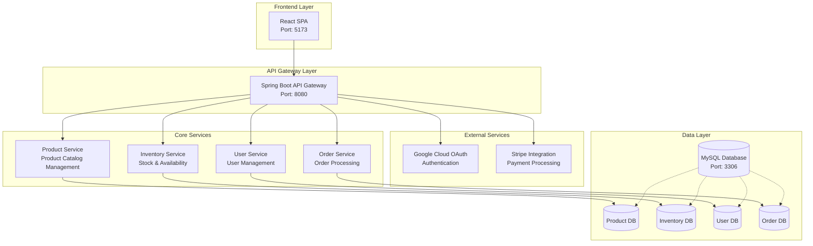
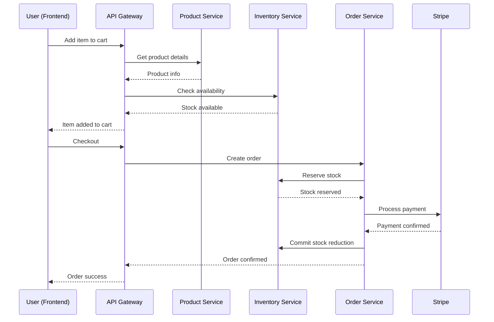

<div align="center">
  
  
  # 🛒 Shokify
  
  **A Modern E-commerce Platform Built with Microservice Architecture**
  
  [](https://github.com/kam-stand/Shokify/stargazers)
  [](https://github.com/kam-stand/Shokify/network/members)
  [](https://github.com/kam-stand/Shokify/graphs/contributors)
  [](https://github.com/kam-stand/Shokify/issues)
  [](LICENSE)
  
  [](https://github.com/kam-stand/Shokify/actions/workflows/github-actions-demo.yml)
</div>

---

## 📋 Table of Contents

- [About](#about)
- [Tech Stack](#tech-stack)
- [Architecture](#architecture)
- [Features](#features)
- [Prerequisites](#prerequisites)
- [Installation](#installation)
- [Usage](#usage)
- [Docker Setup](#docker-setup)
- [Contributing](#contributing)
- [Acknowledgments](#acknowledgments)
- [Contact](#contact)

---

## 🎯 About

Shokify is a cutting-edge e-commerce platform designed with microservice architecture principles. Built for scalability, performance, and modern user experience, it provides a complete online shopping solution with integrated payment processing, OAuth authentication, and cloud-native deployment.

---

## 🛠️ Tech Stack

### **Frontend**

[](https://reactjs.org/)
[](https://vitejs.dev/)
[](https://developer.mozilla.org/en-US/docs/Web/JavaScript)
[](https://developer.mozilla.org/en-US/docs/Web/HTML)
[](https://developer.mozilla.org/en-US/docs/Web/CSS)

### **Backend**

[](https://spring.io/projects/spring-boot)
[](https://openjdk.org/)
[](https://spring.io/projects/spring-security)
[](https://gradle.org/)

### **Database**

[](https://www.mysql.com/)
[](https://hibernate.org/)

### **Authentication & Payments**

[](https://cloud.google.com/)
[](https://stripe.com/)
[](https://oauth.net/2/)

### **DevOps & Deployment**

[](https://www.docker.com/)
[](https://podman.io/)
[](https://github.com/features/actions)

---

## 🏗️ Architecture

Shokify follows a **microservice architecture** pattern with the following components:



### **Microservices Breakdown**

| Service               | Responsibility                                     | Port | Database Schema                                |
| --------------------- | -------------------------------------------------- | ---- | ---------------------------------------------- |
| **Product Service**   | Product catalog, categories, descriptions, pricing | 8081 | `products`, `categories`, `product_categories` |
| **Inventory Service** | Stock levels, warehouse management, availability   | 8082 | `inventory`, `stock_movements`, `warehouses`   |
| **User Service**      | User profiles, authentication, preferences         | 8083 | `users`, `user_profiles`, `user_preferences`   |
| **Order Service**     | Order processing, cart management, checkout        | 8084 | `orders`, `order_items`, `shopping_carts`      |
| **API Gateway**       | Request routing, load balancing, authentication    | 8080 | -                                              |

### **Service Communication**

- **Frontend ↔ API Gateway**: RESTful API calls
- **API Gateway ↔ Microservices**: Internal service communication
- **Product ↔ Inventory**: Real-time stock validation
- **Order ↔ Product**: Product information retrieval
- **Order ↔ Inventory**: Stock reservation and updates
- **All Services ↔ Auth**: OAuth token validation
- **Order ↔ Stripe**: Payment processing

### **Data Flow Example: Purchase Process**



---

---

## ✨ Features

- 🛍️ **Product Catalog Management**
- 🛒 **Shopping Cart & Checkout**
- 🔐 **OAuth Authentication (Google)**
- 💳 **Stripe Payment Integration**
- 📱 **Responsive Design**
- 🔒 **Secure API Endpoints**
- 🐳 **Containerized Deployment**
- 🧪 **Automated Testing Pipeline**

---

## 📋 Prerequisites

Before running Shokify, ensure you have the following installed:

- **Java 21** or higher
- **Node.js 22** or higher
- **MySQL 8.0** or higher
- **Docker** or **Podman**
- **Git**

---

## 🚀 Installation

### **1. Clone the Repository**

```bash
git clone https://github.com/kam-stand/Shokify.git
cd Shokify
```

### **2. Backend Setup**

```bash
cd server/shokify

# Install dependencies and build
./gradlew build

# Run the application
./gradlew bootRun
```

### **3. Frontend Setup**

```bash
cd client/shokify-frontend

# Install dependencies
npm install

# Start development server
npm run dev
```

### **4. Database Setup**

```bash
# Connect to MySQL
mysql -u root -p

# Create database and user
CREATE DATABASE shokify;
CREATE USER 'shokify_user'@'localhost' IDENTIFIED BY 'Kamrul14!';
GRANT ALL PRIVILEGES ON shokify.* TO 'shokify_user'@'localhost';
FLUSH PRIVILEGES;
EXIT;
```

---

## 🐳 Docker Setup

### **Using Docker Compose**

```bash
# Build and start all services
docker-compose up --build

# Run in background
docker-compose up -d --build

# Stop all services
docker-compose down

# Remove volumes (clean slate)
docker-compose down -v
```

### **Using Podman Compose (Alternative)**

```bash
# Build and start all services
podman-compose up --build

# Run in background
podman-compose up -d --build

# Stop all services
podman-compose down
```

### **Individual Container Commands**

```bash
# Build images
docker build -f Dockerfile.frontend -t shokify-frontend .
docker build -f Dockerfile.backend -t shokify-backend .

# Run MySQL
docker run -d --name shokify-mysql \
  -e MYSQL_ROOT_PASSWORD=Kamrul14 \
  -e MYSQL_DATABASE=shokify \
  -e MYSQL_USER=shokify_user \
  -e MYSQL_PASSWORD=Kamrul14! \
  -p 3306:3306 \
  mysql:8.0

# Run Backend
docker run -d --name shokify-backend \
  -p 8080:8080 \
  --link shokify-mysql:mysql \
  shokify-backend

# Run Frontend
docker run -d --name shokify-frontend \
  -p 5173:5173 \
  shokify-frontend
```

---

## 📖 Usage

### **Access the Application**

- **Frontend**: http://localhost:5173
- **Backend API**: http://localhost:8080
- **Database**: localhost:3306

### **API Endpoints**

```bash
# Health check
GET http://localhost:8080/

# Expected Response: "Hello, Shokify!"
```

### **Development Profiles**

```bash
# Local development (native MySQL)
./gradlew bootRun --args='--spring.profiles.active=local'

# Docker development (containerized MySQL)
./gradlew bootRun --args='--spring.profiles.active=docker'
```

---

## 🤝 Contributing

We welcome contributions! Please see our contributing guidelines.

### **How to Contribute**

1. Fork the repository
2. Create a feature branch (`git checkout -b feature/amazing-feature`)
3. Commit your changes (`git commit -m 'Add amazing feature'`)
4. Push to the branch (`git push origin feature/amazing-feature`)
5. Open a Pull Request

### **Found a Bug?**

Please create an issue [here](https://github.com/kam-stand/Shokify/issues/new).

---

## 🙏 Acknowledgments

This project is built with amazing open-source technologies:

[](https://spring.io/projects/spring-boot)
[](https://reactjs.org/docs/getting-started.html)
[](https://dev.mysql.com/doc/)
[](https://docs.docker.com/)
[](https://stripe.com/docs)
[](https://cloud.google.com/docs)

Special thanks to the open-source community for providing these incredible tools.

---

## 📧 Contact

**Kam Hassan**

[](mailto:kh84590@gmail.com)
[](https://linkedin.com/in/kam-hassan)
[](https://github.com/kam-stand)

---

<div align="center">
  
  **⭐ Star this repository if you find it helpful!**
  
  Made with ❤️ by [Kam Hassan](https://github.com/kam-stand)
  
</div>
